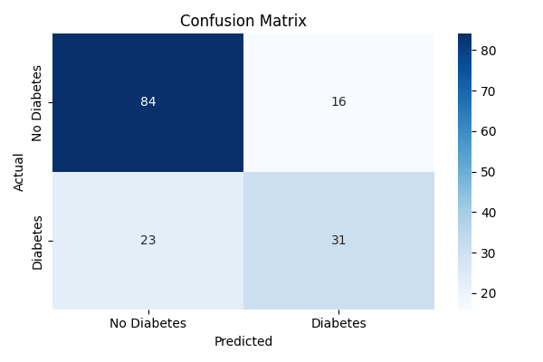
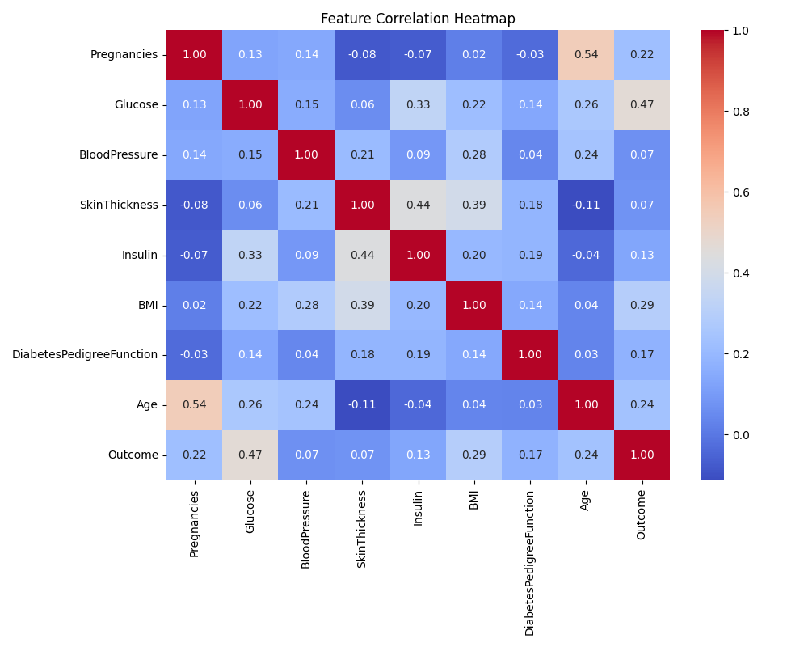
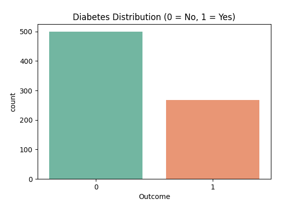

# 🩺 Disease Prediction ML Web App
### Built by Yashika Sharma | github.com/Yashika41

A machine learning web application that predicts diabetes risk based on health parameters, built using Python, Scikit-learn, and Flask.

---

## 📁 Project Structure

```
disease-prediction/
│
├── disease_prediction.py   ← STEP 1: Run this first (ML model training)
├── app.py                  ← STEP 2: Run this to launch the web app
│
├── templates/
│   └── index.html          ← The web interface (put index.html here)
│
├── diabetes.csv            ← Dataset from Kaggle (download separately)
├── model.pkl               ← Auto-generated after running Step 1
├── scaler.pkl              ← Auto-generated after running Step 1
│
└── README.md               ← This file
```

---

## 🚀 How to Run (Step by Step)

### Step 1 — Install required libraries
Open your terminal and run:
```bash
pip install pandas numpy scikit-learn matplotlib seaborn flask
```

### Step 2 — Download the dataset
1. Go to: https://www.kaggle.com/datasets/uciml/pima-indians-diabetes-database
2. Download `diabetes.csv`
3. Place it in the same folder as `disease_prediction.py`

### Step 3 — Train the ML model
```bash
python disease_prediction.py
```
This will:
- Clean and explore the data
- Train Logistic Regression and Random Forest models
- Show accuracy scores and charts
- Save `model.pkl` and `scaler.pkl`

### Step 4 — Set up the web app
Create a folder called `templates` and put `index.html` inside it:
```
mkdir templates
mv index.html templates/
```

### Step 5 — Launch the Flask app
```bash
python app.py
```
Then open your browser and go to: **http://localhost:5000**

---

## 🧠 How It Works

1. User enters health data (glucose, BMI, age, etc.) in the web form
2. Flask receives the form data and passes it to the trained model
3. The model scales the input using the saved scaler
4. Random Forest or Logistic Regression predicts the risk (0 or 1)
5. The result and confidence percentage are shown on screen

---

## 📊 Dataset

- **Source:** Pima Indians Diabetes Database (UCI / Kaggle)
- **Samples:** 768 patients
- **Features:** 8 health parameters
- **Target:** Outcome (0 = No Diabetes, 1 = Diabetes)

| Feature | Description |
|---|---|
| Pregnancies | Number of pregnancies |
| Glucose | Plasma glucose concentration |
| BloodPressure | Diastolic blood pressure (mm Hg) |
| SkinThickness | Triceps skin fold thickness (mm) |
| Insulin | 2-Hour serum insulin (μU/mL) |
| BMI | Body mass index |
| DiabetesPedigreeFunction | Family history score |
| Age | Age in years |

---

## 📈 Model Performance
| Metric | Score |
|---|---|
| Precision | 0.660 |
| Recall | 0.574 ← clinically most important |
| F1 Score | 0.623 ± 0.022 (5-fold CV) |
| ROC-AUC | 0.811 |

---

## 📊 Project Visualizations[[1](https://www.google.com/url?sa=E&q=https%3A%2F%2Fgithub.com%2FYashika41%2FDisease-Prediction-ML)]

### Confusion Matrix


### Correlation Heatmap


### Data Distribution


---

## 🛠️ Tech Stack

- **Python** — Core language
- **Pandas & NumPy** — Data loading and cleaning
- **Scikit-learn** — ML model training and evaluation
- **Matplotlib & Seaborn** — Data visualization
- **Flask** — Web framework
- **HTML & CSS** — Frontend interface
- **Pickle** — Model saving and loading

---

## 👩‍💻 Developer

**Yashika Sharma**
- 🎓 B.Tech AI/ML — Dronacharya College of Engineering, Gurugram
- 💻 GitHub: [@Yashika41](https://github.com/Yashika41)
- 🔗 LinkedIn: [yashika-sharma-213775223](https://linkedin.com/in/yashika-sharma-213775223)

---

## ⚠️ Disclaimer

This application is built for **educational purposes only** and is not intended to replace professional medical diagnosis or advice.
